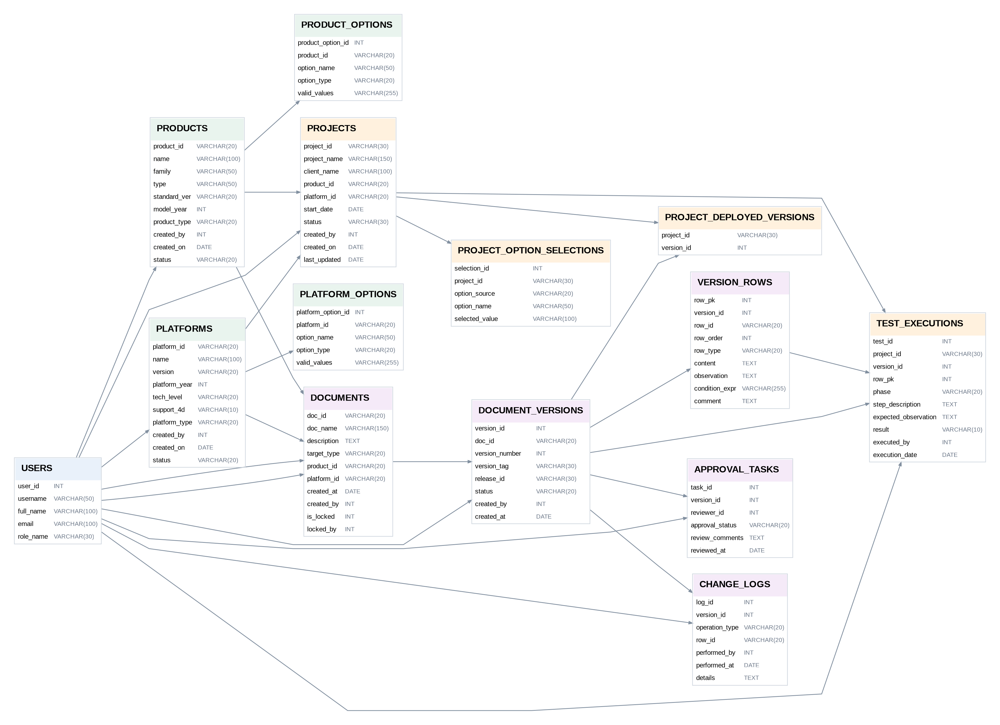

# ACME Simulators | Database Design & SQL Analysis

## Project Overview

ACME Simulators is a database design project focused on supporting the operations of a company that develops customized driving simulators. Each customer project combines a vehicle model, simulator platform, and configuration-specific requirements.

Working collaboratively in a four-person team, we designed and implemented a relational database to organize customer projects, simulator configurations, technical documentation, approval workflows, and testing results.

The project involved translating business requirements into a structured data model, defining relationships and constraints, populating the database with sample records, and developing 20 SQL queries to support operational and reporting needs.

## Database Schema

The implemented database consists of 14 interconnected tables covering product and platform configurations, customer projects, document versioning, approval processes, change tracking, and testing.

*Database schema diagram based on the Phase 2 SQL implementation.*

## Tools & Skills

- SQL (MySQL)
- Relational Database Design
- Entity-Relationship Modeling
- Data Modeling and Normalization
- Primary and Foreign Keys
- SQL Joins, Aggregations, and Subqueries
- Business Requirements Analysis

## SQL Implementation

The project includes database table creation, integrity constraints, sample data, and 20 SQL queries.

[View SQL Implementation](acme_database.sql)
